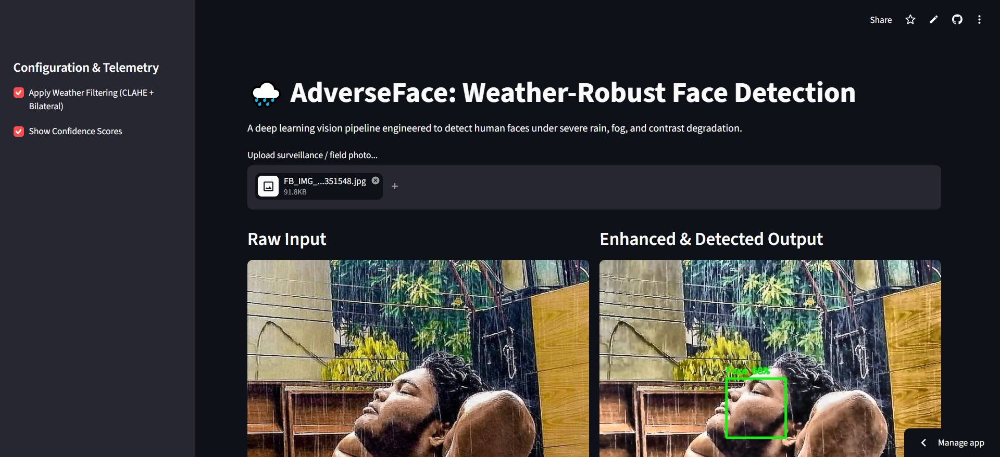

# 🌧️ AdverseFace: Weather-Robust Face Detection Microservice

[](https://adverse-face-api.streamlit.app)
[](https://www.python.org/)
[](https://fastapi.tiangolo.com/)
[](https://opencv.org/)

A production-engineered computer vision microservice designed to maintain high face detection recall under severe environmental degradations (heavy rain noise, optical washout, and atmospheric fog). 

Derived from applied research on de-raining pipelines and domain-adaptive vision at Bahria University.

---

## 🎯 Pipeline Demonstration



*Comparison: Raw degraded surveillance feed (left) vs. preprocessed and localized facial bounding box (right).*

---

## ⚡ Core Architecture

The system decouples environmental noise reduction from neural inference across two sequential stages:

```
Raw Degraded Image (Rain/Fog)
              │
              ▼
 Stage 1: Physical Preprocessing (preprocessor.py)
   ├── BGR ➔ LAB Color Space Conversion (Decouples luminance from chromatic channels)
   ├── Tile-Grid CLAHE (Adaptive local contrast enhancement without over-saturation)
   └── Bilateral Filtering (Edge-preserving high-frequency rain streak suppression)
              │
              ▼
 Stage 2: Deep Neural Inference (detector.py)
   ├── MediaPipe BlazeFace Backbone (SSD anchor-based lightweight architecture)
   ├── Dynamic Bounding Box Denormalization & Border Clamping
   └── Microsecond Precision Inference Benchmarking
              │
              ▼
 Delivery Layer: FastAPI Microservice (main.py) & Streamlit Evaluation Dashboard (ui.py)
```

---

## 🚀 Key Engineering Highlights

- **Adverse-Weather Restoration:** Solves facial feature loss caused by rainy streaks and fog washouts using LAB-space CLAHE and bilateral filtering prior to model inference.
- **Sub-25ms CPU Latency:** Lightweight architecture tailored for real-time edge streaming without requiring dedicated GPU clusters.
- **Production REST Microservice:** Asynchronous FastAPI backend providing structured JSON inference responses, confidence scoring, and OpenAPI/Swagger documentation.
- **Containerized Deployment:** Bundled with a production-ready `Dockerfile` and automated Debian system library configurations (`packages.txt`).

---

## 🛠️ Tech Stack

- **Deep Learning / CV:** MediaPipe BlazeFace, OpenCV (Headless v4.x), NumPy
- **API Framework:** FastAPI, Uvicorn, Python-Multipart
- **Interactive UI:** Streamlit Cloud
- **DevOps:** Docker, Git/GitHub

---

## 📡 API Reference

### Health Check
```http
GET /
```
Returns system operational state and supported degradation profiles.

### Infer Coordinates
```http
POST /api/v1/detect?enhance_weather=true
Content-Type: multipart/form-data
```

**Sample Response:**
```json
{
  "filename": "field_surveillance_01.jpg",
  "weather_enhancement_applied": true,
  "metrics": {
    "total_faces_detected": 1,
    "inference_latency_ms": 17.45,
    "bounding_boxes": [
      {
        "x": 312,
        "y": 140,
        "width": 125,
        "height": 132,
        "confidence": 0.89
      }
    ]
  }
}
```

---

## 💻 Local Quickstart

```bash
# 1. Clone repository
git clone [https://github.com/ahmedrayyan8280/adverse-face-api.git](https://github.com/ahmedrayyan8280/adverse-face-api.git)
cd adverse-face-api

# 2. Setup virtual environment
python -m venv .venv
source .venv/bin/activate  # On Windows: .venv\Scripts\activate

# 3. Install dependencies
pip install -r requirements.txt

# 4. Launch FastAPI Server
uvicorn main:app --reload

# 5. Launch Streamlit Evaluation UI
streamlit run ui.py
```